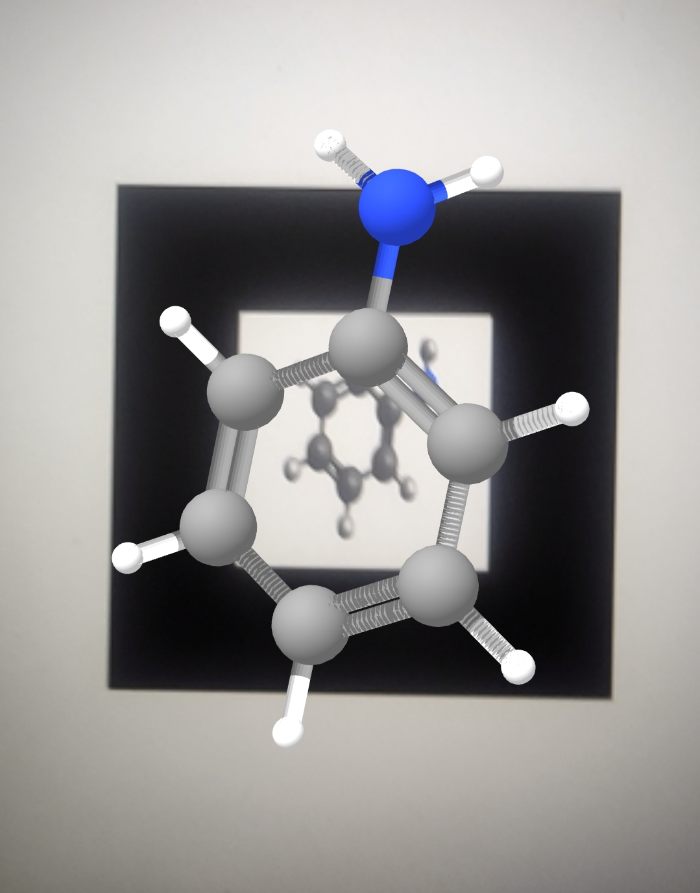

# AR CHEMISTRY

**All the students pursuing chemistry knows that how frustrating it is to imagine the structures of organic compounds and associate it with there chemical properties.
But with the help of AR CHEMISTRY app you can see the actual structure in augmented reality with image tracking and associate them with there chemical and physical properties.**

## Interface

After opening the app user gets the preview of all the available molecules and compounds to select from. After selecting a compound user gets imformation screen and AR preview button.

### Information screen
Information screen contains the basic information about the compound such as its molecular formula , molecular mass , properties and uses etc.

  

### AR view

AR view previews the molecule in AR over the image marker. And using image tracking feature inbuilt in app user can observe the 3D model of compound in different directions, so that he/she can easily count the number of bonds and atoms. All the 3D models have sutable color notations to identify one atom from another.

        

